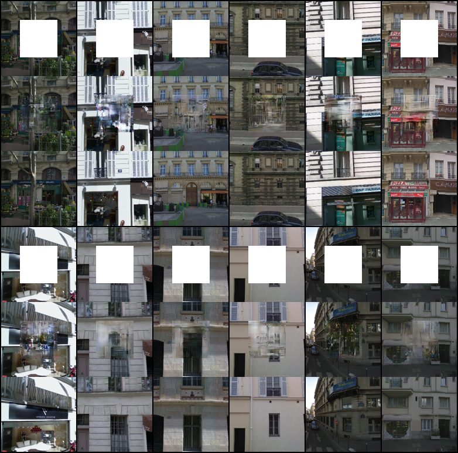

## Implementation of the Context Encoder method 

This is the Pytorch implement of [CVPR 2016 paper on Context Encoders](http://cs.berkeley.edu/~pathak/context_encoder/)

###
| Metrics for test dataset | MSE | PSNR | SSIM |
| ------------- | :-------------: | :-------: | :---: |
| Context Encoder | 0.1549 | 8.1362 | 0.1168 |

The results posted in this repository are the results of training the model for 120 epochs. The duration of training on the NVIDIA® GeForce GT 940MX graphics card was 14 hours. The dataset used in the learning process was Paris Street View. 